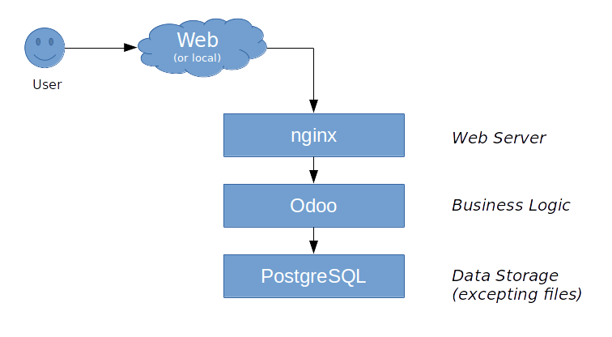

name: number-1
# The world of Odoo: what's new and exciting?
## Odoo Toronto Meetup - May 24, 2017
### Marc Lijour
#### The registered trademark Linux<sup>TM</sup> is used pursuant to a sublicense from LMI, the exclusive licensee of Linus Torvalds, owner of the mark on a world-wide basis.


---
# Agenda

- Installing Odoo on Linux (basic installation)
- Exploring Odoo
- Q&As

---

# Requirements

- Laptop booting on Linux or a Virtual Machine
- or a Virtual Machine on the cloud (e.g. OVH, Amazon, Azure...)
- Any Linux flavour is good (the demo is based on Ubuntu 16.04)

---
# A Two-Step Process

1. Installing a database (PostgreSQL is the only supported product)
1. Installing the Odoo software

### 1) Installing the database

```bash
sudo apt-get install postgresql
sudo su - postgres
```
Now, running as user *postgres* the following commands:

```bash
createuser --createdb --username postgres --no-createrole --no-superuser --pwprompt odoo
exit
```
At this point you should have a running PostgreSQL database ready to work with Odoo.

---
# 2) Installing Odoo

We'll install the Community version. Several methods are described on the [Odoo website](https://www.odoo.com/documentation/10.0/setup/install.html#deb). The following commands need to be run as root.

```bash
sudo su -
wget -O - https://nightly.odoo.com/odoo.key | apt-key add -
echo "deb http://nightly.odoo.com/10.0/nightly/deb/ ./" >> /etc/apt/sources.list.d/odoo.list
```

At this point, Linux knows where to fetch the Odoo software. It is just a matter of refreshing the repos and asking for Odoo.

```bash
apt-get update && apt-get install odoo
exit
```

???
Slides notes here
- comment 1

---
# Test your installation
- point your browser to http://127.0.0.1:8069
- Now you should see the welcome screen asking you to create your first database (i.e. a business in odoo) as show on the right. Click on load demonstration data (so there will be something to look at).
- After a little while, you should see an “appstore”, from where you can pick modules/apps that you need for the business. It should look like the picture below:


---
# Install a few apps
- Try the project app
- The Website Builder
- Discuss
- Go to the **Settings** tab add a couple users.

---
# Limitations of this installation
- Community version vs. Enterprise (added features)
- Not production ready (no domain name, no SSL, limited scalability, no security...)

---
# Anatomy of a 3-tier app


---
# Add nginx as a proxy
First install nginx:
```bash
sudo apt-get install nginx
```
Then download and install the configuration file for nginx, to let it know what to do. Move it to /etc/nginx/sites-available and make a soft link to /etc/nginx/sites-enabled. Restart the nginx server or at least tell it to reload its configuration after testing the parameters.
```bash
nginx -t
sudo service nginx reload
```

---
# Create a SSL certificate
```bash
sudo su -
mkdir -p /etc/nginx/ssl
cd /etc/nginx/ssl
openssl req -x509 -nodes -days 365 -newkey rsa:2048 -keyout /etc/nginx/ssl/odoo.key -out /etc/nginx/ssl/odoo.crt
chmod 600 odoo.key
```
Reload after testing the nginx configuration files.
```bash
nginx -t
sudo service nginx reload
```

---
# Get a domain name
For the sake of the example, we'll just create an alias ("odoo.mysite.co") in the hosts file.

Try http://odoo.mysite.co and  https://odoo.mysite.co

---
# A simple firewall
The Universal firewall in Linux is very easy to use.

```bash
sudo ufw allow 80
sudo ufw allow ssh
sudo ufw allow https
sudo ufw enable
sudo ufw status verbose
sudo ufw disable
```
---
# More serious security
- Always use SSH
- Consider a VPN
- You can get your free SSL certificate (validated) at https://letsencrypt.org (or pay for it at your regular domain name reseller)
- Check [snort](https://www.snort.org/)
- Check [OSSEC](https://ossec.github.io/)
- Check [Suricata](https://suricata-ids.org/)
- Check [Nagios](https://www.nagios.org/)
- Check nmap
- Check Kali Linux, HURD
- Check Truecrypt

---
# Q&As
