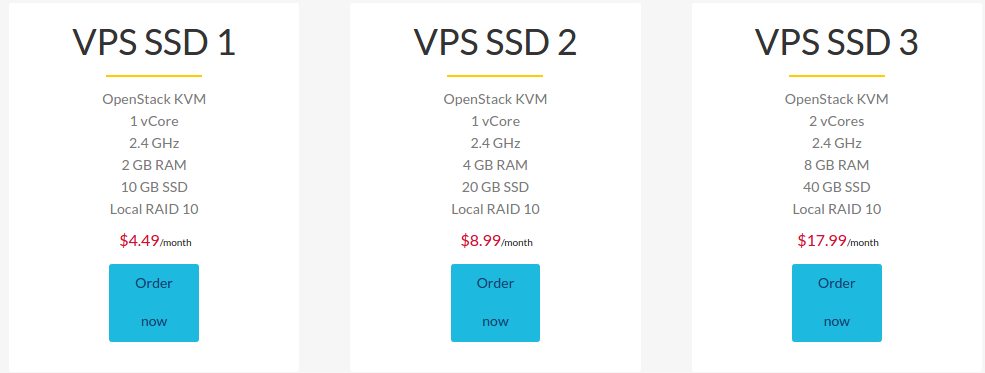
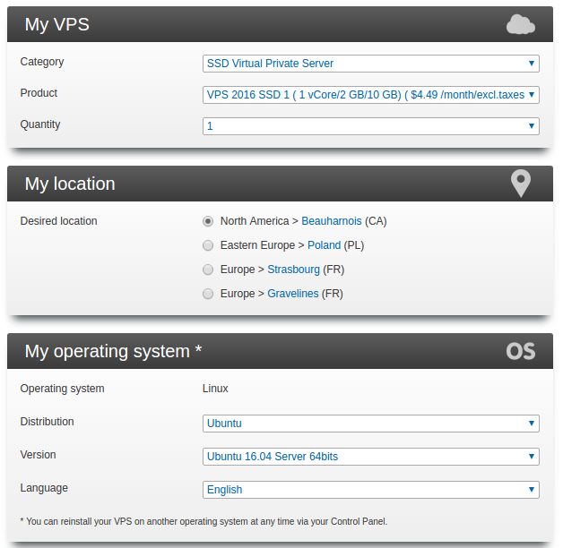
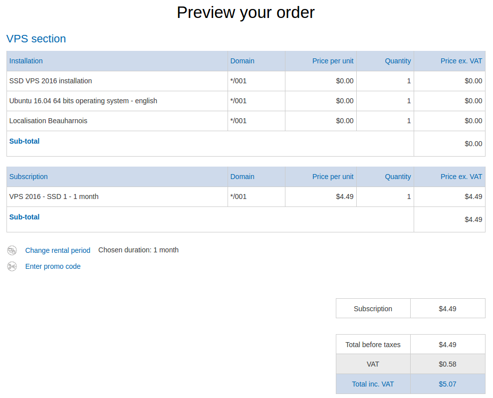

name: number-1
# The world of Odoo: what's new and exciting?
## Odoo Toronto Meetup - May 24, 2017
### Marc Lijour
#### The registered trademark Linux<sup>TM</sup> is used pursuant to a sublicense from LMI, the exclusive licensee of Linus Torvalds, owner of the mark on a world-wide basis.


---
# Agenda

- Installing Odoo on Linux (basic installation)
- Exploring Odoo
- Q&As

---

# Requirements

- Laptop booting on Linux or a Virtual Machine
- or a Virtual Machine on the cloud (e.g. OVH, Amazon, Azure...)
- Any Linux flavour is good (the demo is based on Ubuntu 16.04)

---
# Setting up a VM 
Using [OVH](https://www.ovh.com/ca/en/) as an example. I picked a small [Virtual Private Server (VPS)](https://www.ovh.com/ca/en/vps/vps-ssd.xml) for about $5.



---
# Ordering a Ubuntu 16.04 64-bit machine



---
# Reviewing the order



---
# Configuring SSH and shortcuts 
```bash
$ cat /etc/hosts | grep odoo-demo
1.2.3.4 	odoo-demo
```

```bash
$ cat >> ~/.ssh/config 
Host odoo-demo
	User root
	Hostname vps1234567.vps.ovh.ca
```

---
# Login via SSH
```bash
ssh odoo-demo
```
OVH will have sent you the password.

---
# Disabling login authentication via password 
This is more secure.

From your local machine

```bash
$ scp ~/.ssh/id_rsa.pub root@odoo-demo:/root/
```

On the remote machine

```bash
# cat id_rsa.pub >> .ssh/authorized_keys 
```

Then edit **/etc/ssh/sshd_config** to change to 

```bash 
PasswordAuthentication no
```

Now you can login directly with ssh, no password.

---
# Update Ubuntu
```bash
apt-get update
apt-get upgrade
```

---
# A Two-Step Process Installation

1. Installing a database (PostgreSQL is the only supported product)
1. Installing the Odoo software

### 1) Installing the database

```bash
sudo apt-get install postgresql
sudo su - postgres
```
Now, running as user *postgres* the following commands:

```bash
createuser --createdb --username postgres --no-createrole --no-superuser --pwprompt odoo
exit
```
At this point you should have a running PostgreSQL database ready to work with Odoo.

---
# 2) Installing Odoo

We'll install the Community version. Several methods are described on the [Odoo website](https://www.odoo.com/documentation/10.0/setup/install.html#deb). The following commands need to be run as root.

```bash
sudo su -
wget -O - https://nightly.odoo.com/odoo.key | apt-key add -
echo "deb http://nightly.odoo.com/10.0/nightly/deb/ ./" >> /etc/apt/sources.list.d/odoo.list
```

At this point, Linux knows where to fetch the Odoo software. It is just a matter of refreshing the repos and asking for Odoo.

```bash
apt-get update && apt-get install odoo
exit
```

???
Slides notes here
- comment 1

---
# Test your installation
- point your browser to http://127.0.0.1:8069
- Now you should see the welcome screen asking you to create your first database (i.e. a business in odoo) as show on the right. Click on load demonstration data (so there will be something to look at).
- After a little while, you should see an “appstore”, from where you can pick modules/apps that you need for the business. It should look like the picture below:


---
# Install a few apps
- Try the project app
- The Website Builder
- Discuss
- Go to the **Settings** tab add a couple users.

---
# Limitations of this installation
- Community version vs. Enterprise (added features)
- Not production ready (no domain name, no SSL, limited scalability, no security...)

---
# Q&As
